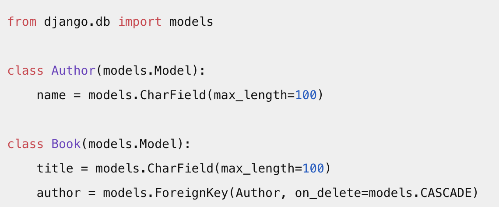
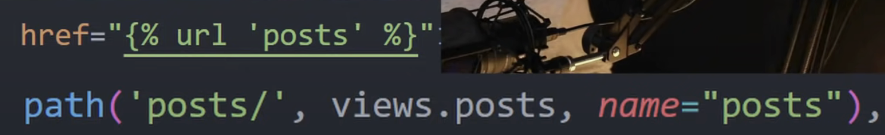
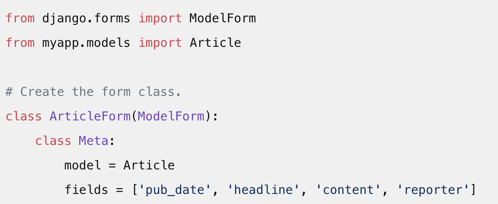

# Basic
- Django: back end Python framwork like Flask.
- What can you build with Django: building APIs forUdemy, Pinterest, Instagram, Dropbox,Youtube.
- Project & APP: Project:an overall environment, website. APP: a component of website, where you hold the project logic.[Facebook.com - new feed]

# Start
- How initialize a project: ```django-admin startproject your_project_name```
- How to start an app: ```python manage.py startapp your_app_name```
- How to run development server: ```python manage.py runserver 8080```
- settings.py: project configuration. database connections,configure your app and the overall command center
    - Database configurations: This is where you define the settings for your **database connection**, including the database engine (like PostgreSQL, MySQL, SQLite), the name of the database, user, password, host, etc.
    - Installed Apps: Django uses the INSTALLED_APPS setting to **locate and load** your applications. When you start a new app using python manage.py startapp your_app_name, you need to add that app to the INSTALLED_APPS setting.
    - Middleware classes: Middleware is a series of **hooks into Django’s request/response processing**. It’s a light, low-level “plugin” system for globally altering Django’s input or output.
    - Template settings: This includes settings for the template engine(s) you’re using with Django.
    - Security settings: This includes various settings for maintaining the security of your Django application such as SECRET_KEY.
- **Models**: the single, definitive **source** of information about your data which contain the **essential fields and behaviors** of the **data** you’re storing.
- **Views**: functions that **take a web request and return a web response**, acting as a **bridge** between models and templates.
- **Templates**: generating HTML dynamically, allowing you to insert code-like elements in your HTML to represent variables and other pieces of logic.

# Models
- foreign key: model attributes, sets one to many relationship between one model and another
    - one to one: user-profile
    - many to many: book- catagory

- Query: 
    - query all items in a database table: ```all_books = Book.objects.all()```
    - query one item: ```specific_book = Book.objects.get(title='Django Unleashed')```
    - filter: ```python_books = Book.objects.filter(title__contains='Python')```

# Views
- **Function-Based Views (FBVs)**: These are simple and easy to use, where **each view function handles a specific request path**.
- **Class-Based Views (CBVs)**: These are more complex but offer code reusability through inheritance and come with **built-in features for common tasks**.

# URL
- URL patterns?: connecting urls to views and it is a navigation to the website. map URLs to views, serving different content based on the accessed URL.
- Name urls and access them dynamically: change the url path(not hard coding)


# Templates
- store templates: Django app structure template/app_name/<...>.   ```setings.py``` ```TEMPLATES``  

```<h2>{{profile}}</h2>```
- Tags:h2 
- Variables: profile
- logic: 
```

<tr>
    <td>{{order.id}}</td>
</tr>

```
- including
- inheriting
```



    <h2>Template content</h2>


```
# static files
- static files: CSS, JavaScripts, imgs...
- store: settings.py ```STATICFILES_DIRS = [ os.path(BASE_DIR,'static)]```
- ```python manage.py collectstatic``` takes all of our static file from static root bundles them.
- serve static files during production: AWS S3/ third-party packages Django white noise


# Admin
- Admin panel: a graphical user interface to see your data

# Database
- ```python manage.py makemigrations```: prep database, create new migrations based on the changes detected in your models.

- database: Postgres, MySQL,oracle. 
    - in settings.py ```DATABASE```dictionary, we can update and modify database connections

# Others
- MEDIA_ROOT: upload user-generated content
- CSRF Tokens: a security measure to protect against Cross-Site Request Forgery attacks by ensuring requests are made by the actual users of a site.
- Model forms: create forms based on Django models for efficient data entry and modification. 
- DRF Django Restful framwork: toolkit for building Web APIs
- Singles: what's going on in differnet parts of application
- Model serializer: python data -> json data